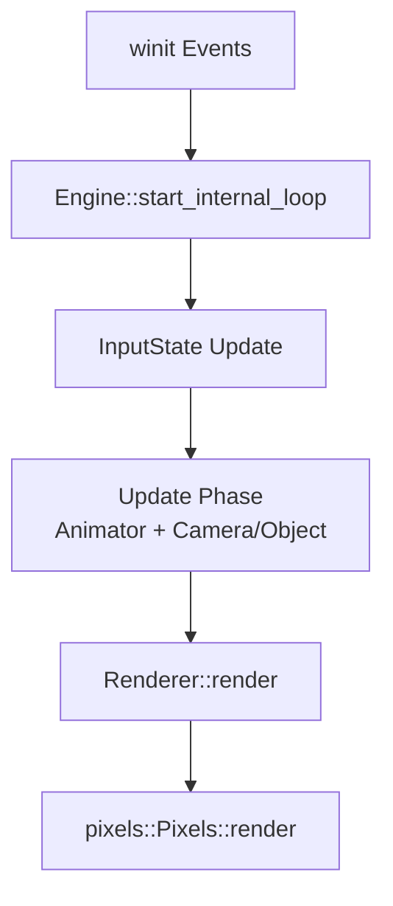
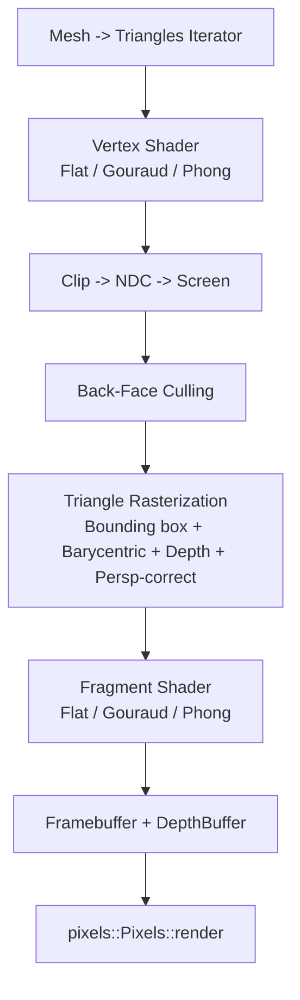

# Architecture: PawnGFX

PawnGFX is a CPU-based software renderer with a minimal game-loop style architecture. The core flow is driven by `winit` events and a simple engine that updates input, animation, and rendering each frame.

## Key Components
- `Engine`: Owns `Scene`, `Renderer`, and `InputState` and coordinates the loop.
- `Scene`: Holds camera, object, light, texture, and animator state.
- `Renderer`: Builds per-frame uniforms and executes the raster pipeline.
- `Rasterizer`: Converts triangles into pixels with depth testing and shading.
- `Shaders`: Pluggable vertex/fragment effects (`Flat`, `Gouraud`, `Phong`).

## App Execution Flow
The following diagram shows the whole app loop and data flow for a frame.

## Rendering Pipeline
The rendering pipeline is fully CPU-based and uses a shader-like interface.

## Shader Effects
- `Flat`: Per-face normal lighting.
- `Gouraud`: Per-vertex diffuse lighting with interpolated intensity.
- `Phong`: Per-fragment diffuse + specular lighting.

## Notes on Uniforms and Varyings
- `GlobalUniforms` contain matrices, light direction, camera position, and lighting params.
- `VertexShader` outputs clip-space position plus `Varyings`.
- `Varyings` are perspective-correct interpolated per fragment.
